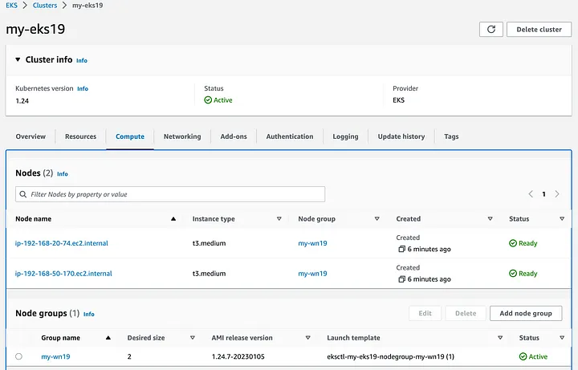

# EKS_K8s

Use Amazon EKS to create a K8s deployment


Amazon EKS is managed Kubernetes service in the AWS cloud and on-premises data center.

In the cloud, Amazon EKS automatically manages the availability and scalability of the Kubernetes control plane nodes responsible for scheduling containers, managing application availability, storing cluster data etc.

With Amazon EKS you can take advantage of all performance, scale, reliability, and availability of AWS infra, as well as integrations with AWS networking and security services.

On premises, AKS provides a consistent, fully supported Kubernetes solution with integrated tooling and simple deployment to AWS Outposts, virtual machines, or bare metal servers.

Agenda:

1. Create a deployment that runs the nginx image
2. Display the details of this deployment
3. Check the event logs from the deployment
4. Delete the deployment

Step 1: In the AWS Console, I will start up an EC2 Instance using an Amazon Linux 2023 AMI with a free tier t2.micro instance type. I will also utilize a key pair.


Be sure to confirm that the Auto-assign public IP is ‘Enabled’.


Step 2: Now that I have my EC2 up and running, I will Connect to it. While I typically ssh into it, today I will be using the EC2 Instance Connect option.

It is important to ensure the needed versions and updates are in place. In the command line, I will confirm which CLI version is currently running.

```
 aws --version
aws-cli/2.9.19 Python/3.9.16 Linux/6.1.29-50.88.amzn2023.x86_64 source/x86_64.amzn.2023 prompt/off
```

I need to check the location of AWS with the ‘which aws’ command. As you can see, it is currently in /usr/bin/aws.

```
which aws
/usr/bin/aws
```

(If you are getting a different result, you’ll need to modify the ‘/usr/bin’ portion of the command to match up with your location.)

To configure the CLI, run ‘aws configure’, enter your AWS IAM user Access Key and Secret Access Key. I am using the us-east-2 region and need the output format in json.

Step 3: It is now time to install kubectl and include execute capabilities with the commands below.

```
curl -O https://s3.us-west-2.amazonaws.com/amazon-eks/1.27.1/2023-04-19/bin/linux/amd64/kubectl

chmod +x ./kubectl
```

I will copy the file into a directory in my PATH so I will be able to access it as needed.

```
mkdir -p $HOME/bin && cp ./kubectl $HOME/bin/kubectl && export PATH=$PATH:$HOME/bin 
```

To confirm kubectl is installed correctly, use the following command.

```
kubectl version --short --client
Client Version: v1.27.1-eks-2f008fe
Kustomize Version: v5.0.1
```

eksctl is a simple command line tool for creating and managing Kubernetes clusters on Amazon EKS. eksctl provides the fastest and easiest way to create a new cluster with nodes for Amazon EKS.

Install eksctl:

```
curl --silent --location "https://github.com/weaveworks/eksctl/releases/latest/download/eksctl_$(uname -s)_amd64.tar.gz" | tar xz -C /tmp
```

It downloads the information to /tmp by default so I will move it to /usr/bin.

```sudo mv /tmp/eksctl /usr/bin
```

Confirm what version of eksctl is being run.

```
eksctl version
0.144.0
```

No successfully configured and updated the CLI, as well as installed the **kubectl** and **eksctl** .

Step 4: Next, I will use AWS Elastic Kubernetes Service to create my EKS cluster.

```
 eksctl create cluster --name <cluster_name> --region us-east-2 --nodegroup-name <worker_node_name> --node-type t3.medium --nodes 2 --nodes-min 1 –-nodes-max 4 --managed
```

Here's I've indicated:

A cluster name, region us-east-2, a group of managed worker nodes,
the instance type, 2 worker nodes with an auto scaling group identifying parameters in place for a minimum 1 and maximum 4 nodes.

It will take about 10–15 minutes to create the cluster. While I wait, I’ll head to the Console to follow along.

In the Cloud Formation dashboard, navigate to the Events tab and you can see everything that is occurring. It is creating security groups for the control plane, route tables, subnets, etc… and much more.


Success! My cluster and worker nodes are now ready.




In the EC2 dashboard, I can also see that I have 3 instances running — one for the control plane and two for each worker node.


```
eksctl get cluster
NAME	REGION		EKSCTL CREATED
my-eks	us-east-2	True

aws eks update-kubeconfig --name <cluster_name> --region us-east-2

kubectl get nodes
```

Step 5: Now, it is time to create a deployment that is running the nginx image.

```
kubectl create deployment nginx-deploy --image nginx
deployment.apps/nginx-deploy created

kubectl get pod
NAME                            READY   STATUS    RESTARTS   AGE
nginx-deploy-864bcf4b95-7q57r   1/1     Running   0          9s

kubectl get deployment
NAME           READY   UP-TO-DATE   AVAILABLE   AGE
nginx-deploy   1/1     1            1           21s

# We can scale up to 3 replicas
kubectl scale --replicas=3 deployment/nginx-deploy
deployment.apps/nginx-deploy scaled

kubectl get pods
NAME                            READY   STATUS    RESTARTS   AGE
nginx-deploy-864bcf4b95-7q57r   1/1     Running   0          3m53s
nginx-deploy-864bcf4b95-n8hms   1/1     Running   0          6s
nginx-deploy-864bcf4b95-vdwcv   1/1     Running   0          6s

kubectl get rs
NAME                      DESIRED   CURRENT   READY   AGE
nginx-deploy-864bcf4b95   3         3         3       3m59s

kubectl get deployment 
NAME           READY   UP-TO-DATE   AVAILABLE   AGE
nginx-deploy   3/3     3            3           4m7s
```

Step 6: Finally, I will delete my cluster. Since EKS created all of the needed elements, I can simply run the command below and the component will be deleted.

```
eksctl delete cluster <cluster_name>
```


